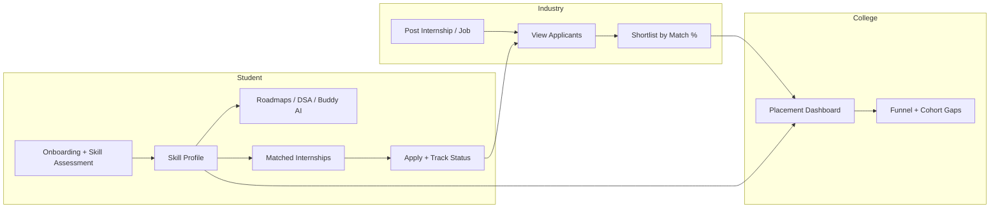
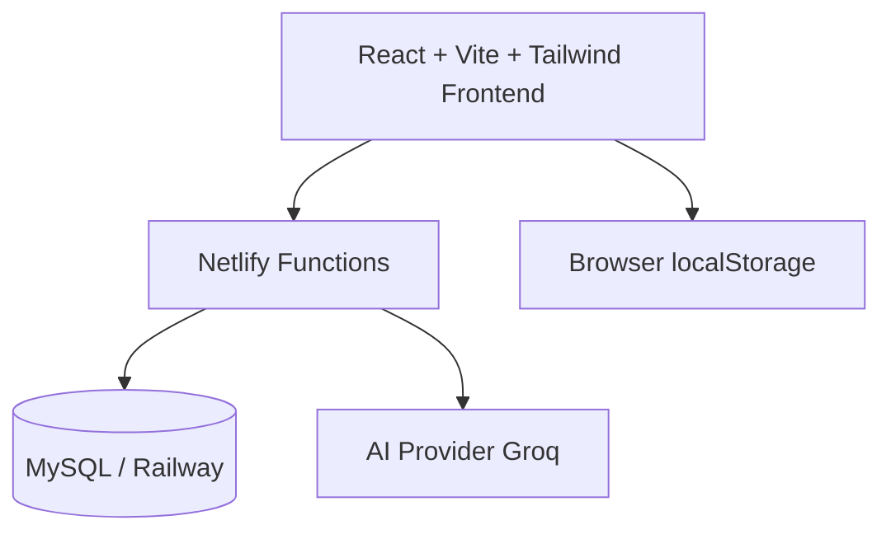

# EDUROUTE

### Academia–Industry Collaboration Portal for Skill Mapping, Internships & Placement

**Smart India Hackathon 2026 · Problem Statement SIH26044**  
*Portal for Academia – Industry collaboration for Skill Mapping, Internships and Placement*

[](https://www.sih.gov.in/)
[](https://sih.gov.in/sih2026PS)
[]()
[]()

**Live site (production):** https://eduroutee.netlify.app/  
**PR #68 deploy preview:** https://deploy-preview-68--eduroutee.netlify.app/

---

## 1. Problem we solve

There is a clear gap between **skills taught in colleges** and **skills expected by industry**.

| Stakeholder | Pain today |
|-------------|------------|
| **Students** | Unclear skill gaps, random internship applications, weak portfolios |
| **Industry** | Hard to find skill-matched candidates; noisy applications |
| **Colleges** | Low visibility into placement funnel and cohort skill gaps |

**EDUROUTE** is a unified portal that connects all three sides with skill assessment, mapping, matching, applications, and placement analytics.

---

## 2. Solution overview



---

## 3. Mapping to SIH26044

| SIH26044 requirement | EDUROUTE feature |
|----------------------|------------------|
| Skill assessment | Onboarding interest tracks + yes/no gap questions |
| Skill mapping | Skill Profile (scores, Good / Improve / Gap) + recommended next steps |
| Internship & job opportunities | Internships feed + Industry postings |
| Matching students ↔ openings | Match % on cards + “Recommended for you” |
| Application & tracking | Apply → Applied → Shortlisted → Interview → Hired |
| Industry collaboration | Industry workspace (`/industry`) |
| Institution visibility | College placement dashboard (`/college/placements`) |
| Learning support (value-add) | Roadmaps, DSA Sheet, Assessments, Buddy AI mentor, Living Learning Path |
| Student portfolio | Digital portfolio (skills, certs, projects, achievements) |
| Faculty collaboration | Faculty opportunities with official portal links |

---

## 4. Feature map

```text
EDUROUTE
├── Student
│   ├── Auth (email + GitHub / LinkedIn OAuth)
│   ├── AI onboarding (track + gap quiz)
│   ├── Skill Profile (scores, gaps, next steps)
│   ├── Profile dashboard
│   │   ├── Total Solved / Rank / XP / Badges
│   │   └── Living Learning Path (nodes + side panel + right-click)
│   ├── Internships (match %, apply pipeline)
│   ├── Roadmaps / Career Paths
│   ├── DSA Sheet, Assessments, Leaderboard, Rewards
│   ├── Community feed
│   ├── CV Builder
│   ├── Portfolio
│   └── Buddy AI + floating “How can I help you?” assistant
├── Faculty
│   └── Opportunities + official portal links
├── Industry
│   ├── Post internship / job
│   └── Applicants + shortlist
└── College
    └── Placement funnel dashboard
```

---

## 5. PR #68 highlights

Branch: `fix/auth-social-login-signin`

| Area | What was added / polished |
|------|---------------------------|
| **Auth** | GitHub & LinkedIn social login (Netlify functions + MySQL upsert where configured) |
| **Floating Buddy** | “How can I help you?” home with 6 shortcut cards; chat after ask; animated tip pill; light/dark |
| **Community** | Community page under Compete → below Rewards; seeded posts; Discord link |
| **Skill Assessments** | Stat cards turn blue on **hover** (no permanent blue on one card) |
| **Profile · Living Learning Path** | Path under Solved / Rank / XP / Badges: completed / in-progress / locked nodes, progress %, detail panel, **right-click** menu, light/dark |
| **Sidebar** | Admin Panel link removed from student dashboard nav |
| **Themes** | Light and dark supported across new UI |

**Production:** https://eduroutee.netlify.app/  
**This PR preview:** https://deploy-preview-68--eduroutee.netlify.app/

**Suggested walkthrough on preview**

1. **Profile** → scroll to **Your Learning Path** → click nodes → right-click a node  
2. Open **floating Buddy** → see 6 cards → ask a question  
3. **Assessments** → hover the three top stats (blue follows hover)  
4. **Community** (Compete section)  
5. Theme toggle light / dark  

---

## 6. Architecture (high level)



| Layer | Stack |
|-------|--------|
| Frontend | React, TypeScript, Vite, Tailwind CSS, Framer Motion |
| Hosting | Netlify (static + serverless functions) |
| Auth / data | MySQL (Railway) via Netlify functions where configured |
| AI mentor | Buddy chat (Groq Llama) + floating widget |
| Demo persistence | localStorage for applications, DSA, path UI state |

---

## 7. Tech stack

```text
Frontend     React 18 · TypeScript · Vite · Tailwind · Lucide · Framer Motion
Routing      React Router
AI           Netlify Functions · Groq
Database     MySQL (Railway) for auth & buddy progress
Deploy       Netlify continuous deploy from GitHub
```

---

## 8. Quick start (developers)

```bash
git clone https://github.com/laxmikhandelwal690-svg/eduroute_.git
cd eduroute_
npm install
npm run dev
```

Optional Netlify env (cloud auth / Buddy):

- `MYSQL_URL` or Railway MySQL vars  
- `JWT_SECRET`  
- `GROQ_API_KEY`  
- OAuth client IDs/secrets for GitHub / LinkedIn when enabling social login  

---

## 9. Why this approach works for SIH

| Jury lens | How EDUROUTE responds |
|-----------|------------------------|
| **Problem clarity** | Directly addresses academia–industry skill gap |
| **Completeness** | Student + Industry + College in one product |
| **Working demo** | Apply → shortlist → placement path + living skill path |
| **Innovation** | Skill gap onboarding + match scoring + AI mentor + path UI |
| **Feasibility** | Standard web stack; live on Netlify today |
| **Impact** | Employability, internship quality, college visibility |

---

## 10. Future scope

- NSQF / NOS formal competency taxonomy  
- Faculty FDP modules  
- Server-synced applications for all roles  
- Verifiable digital credentials on portfolio  
- Adaptive skill assessments tied to path nodes  

---

**EDUROUTE — Learn · Map skills · Match · Get hired**

Live: https://eduroutee.netlify.app/
